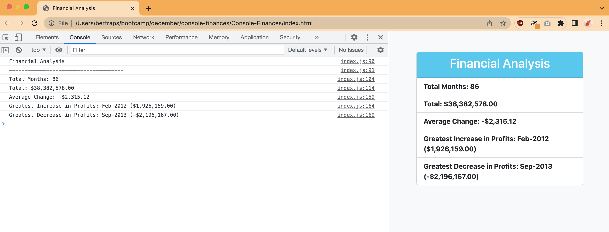

# Console-Finances

## Table of contents

- [About the project](#about)
  - [The challenge](#the-challenge)
  - [Screenshot](#screenshot)
  - [Links](#links)
- [My process](#my-process)
  - [Built with](#built-with)
  - [Useful resources](#useful-resources)
- [Author](#author)
- [License](#license)
- [Contributing](#contributing)

## About the project

### The challenge

Users should be able to see the following calculations on the browsers' console:

- The total number of months included in the dataset.

- The net total amount of Profit/Losses over the entire period.

- The average of the changes in Profit/Losses over the entire period.

- The greatest increase in profits (date and amount) over the entire period.

- The greatest decrease in profits (date and amount) over the entire period.

### Screenshot

### Links

- Solution URL: [https://github.com/berta-rf/Console-Finances](https://github.com/berta-rf/Console-Finances)
- Live Site URL: [https://berta-rf.github.io/Console-Finances](https://berta-rf.github.io/Console-Finances)

## My process

### Built with

- JavaScript
- Semantic HTML5 markup
- Boostrap 5.2

### Useful resources

- [MDN Web Docs on getElementById](https://developer.mozilla.org/en-US/docs/Web/API/Document/getElementById)

## Author

- Berta Romano Fernandez [bertaromanofernandez@gmail.com]
- GitHub - [berta-rf](https://github.com/berta-rf)
- LinkedIn - [Berta Romano Fernandez](https://www.linkedin.com/in/berta-romano-fernandez-85a51117a/)
- Frontend Mentor - [@berta-rf](https://www.frontendmentor.io/profile/)

## License

Distributed under the **MIT license**. See [`LICENSE`](LICENSE) for more information.

## Contributing

Contributions are what make the open source community such an amazing place to learn, inspire, and create. Any contributions you make are **greatly appreciated**.

If you have a suggestion that would make this better, please fork the repo and create a pull request. You can also simply open an issue with the tag "enhancement".
Don't forget to give the project a star! Thanks again!

1. Fork the Project
2. Create your Feature Branch (`git checkout -b feature/AmazingFeature`)
3. Commit your Changes (`git commit -m 'Add some AmazingFeature'`)
4. Push to the Branch (`git push origin feature/AmazingFeature`)
5. Open a Pull Request
